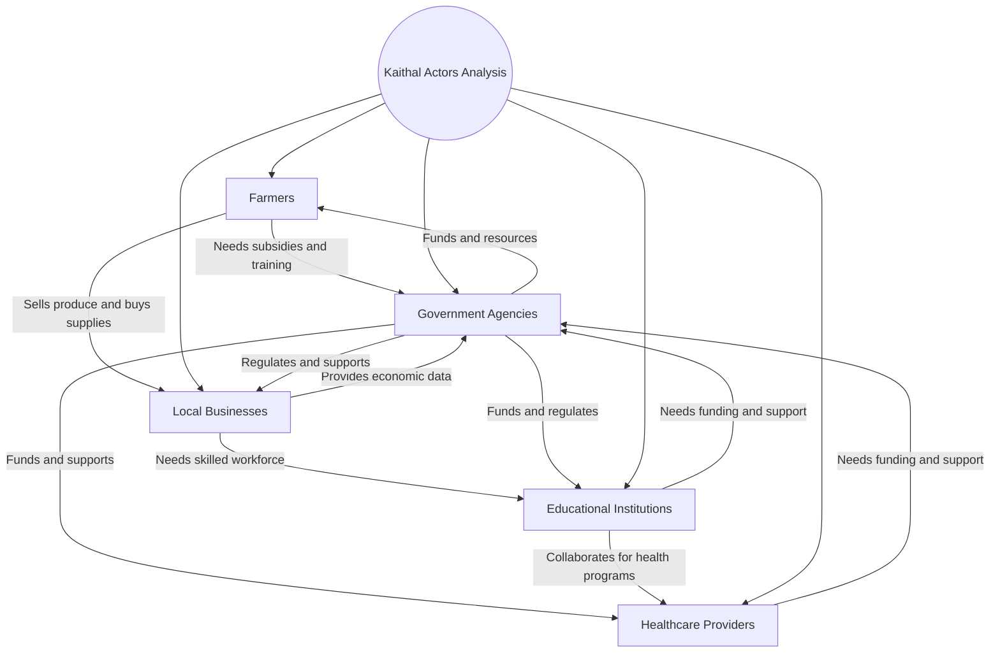

```mermaid
graph TD
    A((Kaithal Actors Analysis))
    
    F[Farmers]
    A --> F
    F --> |"Needs subsidies and training"|GA[Government Agencies]
    F --> |"Sells produce and buys supplies"|LB[Local Businesses]

    LB[Local Businesses]
    A --> LB
    LB --> |"Needs skilled workforce"|EI[Educational Institutions]
    LB --> |"Provides economic data"|GA[Government Agencies]

    GA[Government Agencies]
    A --> GA
    GA --> |"Funds and resources"|F
    GA --> |"Regulates and supports"|LB
    GA --> |"Funds and regulates"|EI
    GA --> |"Funds and supports"|HP[Healthcare Providers]

    EI[Educational Institutions]
    A --> EI
    EI --> |"Collaborates for health programs"|HP
    EI --> |"Needs funding and support"|GA

    HP[Healthcare Providers]
    A --> HP
    HP --> |"Needs funding and support"|GA
```
